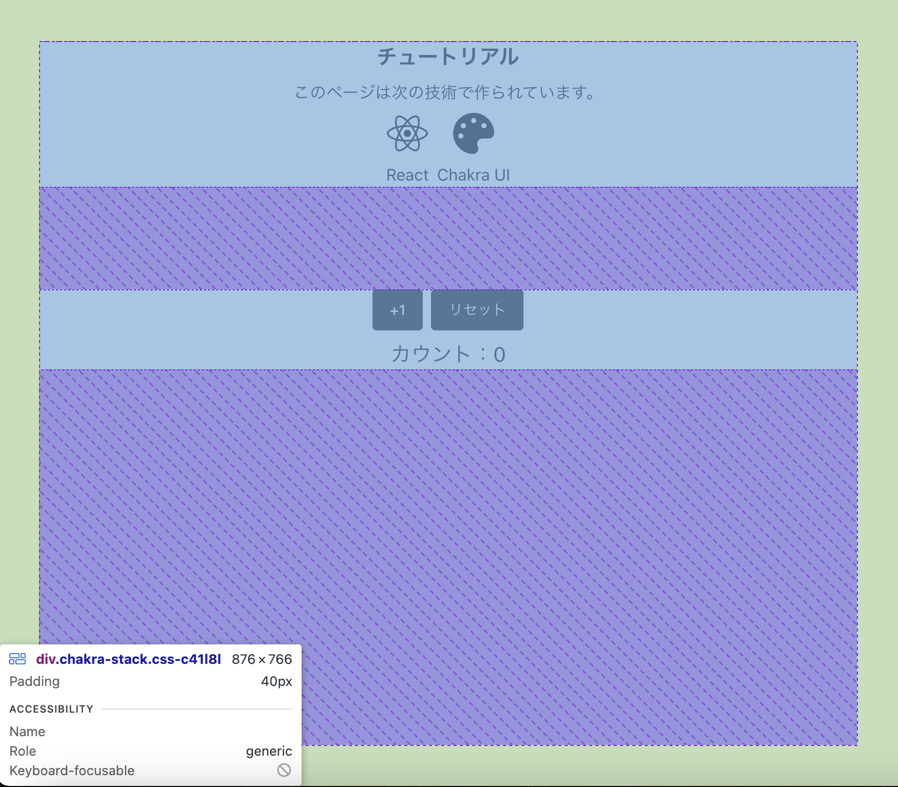
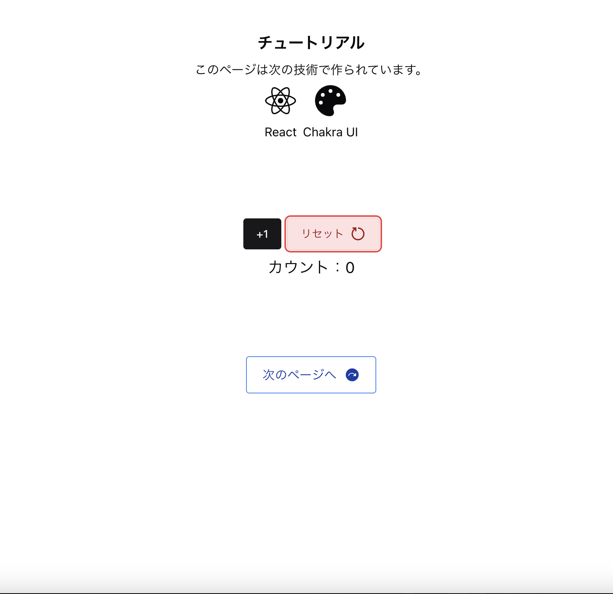

# Assignment0解説

このページは、**Reactの基本機能**と**Chakra UIのレイアウト**の基礎を学ぶためのサンプルページです。

---

## 使用している技術

このページは、以下の技術を使って作られています。

-  **React**（コンポーネント・state 管理）
-  **Chakra UI**（レイアウト・UIデザイン）
-  **react-icons**（アイコン表示）
-  **react-router-dom**（ページ遷移）

---

## 画面の構成

ChakuraUIでは、主に
- Stack：縦並び / 左寄せ
- VStack：縦並び / 横中央寄せ
- HStack：横並び / 縦中央寄せ

を用いることで画面を構成しています。
```jsx        
<VStack>
    <Heading>チュートリアル</Heading>
    <Text>このページは次の技術で作られています。</Text>
    <HStack>
        <VStack>
            <FaReact size={40} />
            <Text>React</Text>
        </VStack>

        <VStack>
            <FaPalette size={40} />
            <Text>Chakra UI</Text>
        </VStack>
    </HStack>
</VStack>
```
このように、Stackを重ねることで、要素を綺麗に並べることができます。また、ブラウザから**コンソール画面**(F12キー)を開くことで以下のように画面の構成を確認することができます。

>### ＊Task1　　画面の配置
>Stackの位置や階層を変えることで画面がどのように変化するか試してみましょう！

---

## ボタンとクリック処理

このページでは、**ボタンを押すと数が増えるカウント機能**を実装しています。  
この機能の中心となるのが **`useState`** です。

```js
const [count, setCount] = useState(0);
```
このコードは、それぞれ以下の意味を持ちます。
| 名前 | 役割 |
|------|------|
| count | 現在のカウントの値を格納する変数 |
|setCount|カウントの値を更新する関数|
|useState(0)|初期値0に設定|

useState を使うことで、値が変わるたびに画面が自動で更新されます。

---
### ボタンの配置
ボタンはChakuraUIのButtonコンポーネントを配置しています。
参考：[ChakuraUI Button](https://chakra-ui.com/docs/components/button)
```js
<Button onClick={increment} >
    +1
</Button>
```
Button内の``onClick``に関数を渡すことで、ボタンをクリックした際の処理を追加することができます。

---
### クリック時の処理
```increment```では、setCount関数を用いてcountを＋1しています。このように、TypeScriptでは、直接変数に値を入れるのではなく、set関数を用いて値を変更します。
```js
    const increment = () => {
        setCount(count + 1);
    };
```

>### ＊Task2　　リセットボタンの実装
>現在、リセットボタンを押しても何も起こらないので、カウントのリセット機能を実装してみましょう

---
### ボタンのデザイン
ChakuraUIのコンポーネントは、```variant```や```colorPalette```など、プロパティを渡すことでデザインを変更できます。
```jsx
<Button variant="surface" colorPalette="red">
    リセット<RiResetRightLine />
</Button>
```
また、```<Button></Button>```で囲まれた部分を**children**と呼び、文字やアイコンを置くことでボタンの中身を設定できます。

>### ＊Task3　　ボタンのデザインと実装
>[ChakuraUI Button](https://chakra-ui.com/docs/components/button)を参考に、適切なプロパティを設定し、下の画像と同じデザインで、次の課題ページに進むためのボタンを実装してみましょう 
>
>アイコン：[React Icons](https://react-icons.github.io/react-icons)
>
