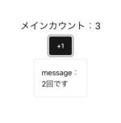
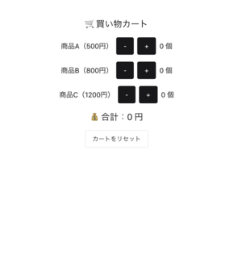

# Assignment2解説

このページでは、**UseEffect**の基礎を学びます。

---
### 非同期更新
http://localhost:5173/#/assignment2 ＋1ボタンを押してみてください。
ボタンを押すと以下の関数が発火します。
```js
    const updateCountMessage = () => {
        // カウントを1増やす
        setCount(count + 1);
        // messageを「count回です」に更新
        setMessage(`${count}回です`);

    }
```
この関数を見ると、`setCount`で `count`を＋1した後に `message`を「count回です」に変更しています。
そのため、`message`には `count`と同じ数値が書かれるように思われます。ですが、実際には、`count`の値が反映されず、1つ前の値が表示されていることがわかります。



これは、**useState**が非同期更新であるため、`setMessage`を呼び出した際には `count`がまだ更新されていないために起こります。

この問題を解消するために用いるのが**UseEffect**です。

---
## useEffectとは？

**useEffect**とは、 「特定の値が変わったときに、自動で処理を実行する仕組み」です。

今回の課題では、
「`count` が変わったときに、自動で `message` も更新したい」
という状況なので、useEffectを用います。

---

### useEffectの基本形

```js
useEffect(() => {
    実行したい処理
}, [依存する値]);
```
のように記載します。
今回の場合は、`count`が変更された場合に、`setMessage`を実行したいので、以下のように記載します。
```js
    useEffect(() => {
        // countが更新されるたびにmessageを更新する
        setMessage(`${count}回です`);
    }, [count]);
```
上記の**useEffect**処理を追加して`count`が即座に`message`に反映されるようにしてみましょう。
**useEffect**の処理が確認できたら、コード下部のコメントアウトを外してTaskに取り組んでみましょう。

>### ＊Task useEffectの利用
>
>
>useEffectを利用してカート内の合計金額を計算するサイトを作ろう！
> - useEffectを用いて合計金額が反映されるようにしよう
> - (復習)リセットボタンを作成して、合計金額がリセットされるようにしよう
> - (復習)-ボタンを作成して個数を減らせるようにしよう（負の数に注意）
> - (発展)商品名をダブルクリックすると商品の金額が編集できるようにしよう

発展問題のヒント
<details>
<summary>💡 ヒント1：ダブルクリックのイベントは？</summary>

Reactでは `onDoubleClick` を使うと  
ダブルクリックを検知できます。

</details>

<details>
<summary>💡 ヒント2：編集モードの切り替え</summary>

```ts
const [isEditing, setIsEditing] = useState(false);
```
のように true / false を持つ state を作って、表示と Input を切り替えましょう。
onBlur → フォーカスが外れたとき
onKeyDown → Enterキーで確定
のどちらかを使うことで実装できます。
</details>

<details>
<summary>💡 ヒント3：Inputの使い方</summary>

```ts
<Input
size="sm"
width="80px"
autoFocus
value={priceC}
onChange={(e) =>
    setPriceC(Number(e.target.value))
}
onBlur={() => setIsEditingC(false)}
onKeyDown={(e) => {
    if (e.key === "Enter") {
        setIsEditingC(false);
    }
}}
/>
```
このInputとTextを三項演算子を用いて、isEditingの状態に応じて表示を切り替えます。
</details>